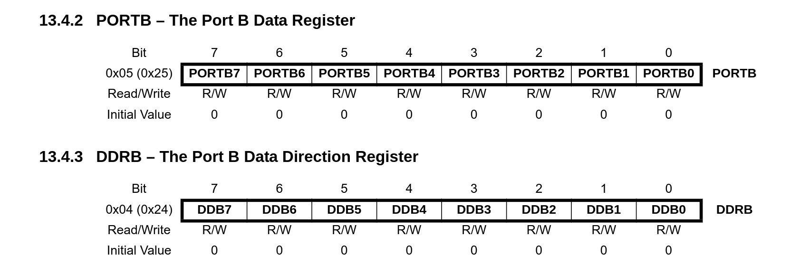

# Blink Led with Baremetal Arduino

## Requirements

### Arduino

We will use Arduino UNO (ATmega328P)

### Installation

We need to install library, compiler, binary to hex converter, and AVR MCU programmer

These applications can be install by following line:

```bash
sudo apt install avr-libc avrdude binutils-avr gcc-avr
```

> **Note !** \
The installation may change depends on your systems or distrubitions.

## Pinouts

To blink led we need to focus on **PORTB-5** (PB-5)

---


## Registers

We control I/O ports by **registers**.

### Data Registers

To read/write data from I/O ports we use **data registers**.

### Data Direction Registers.

To configure I/O ports as input/output we use **data direction registers**.

---



## Upload

We can use **Makefile** to upload our program to Arduino.

To run we can use following line:

```bash
make
```